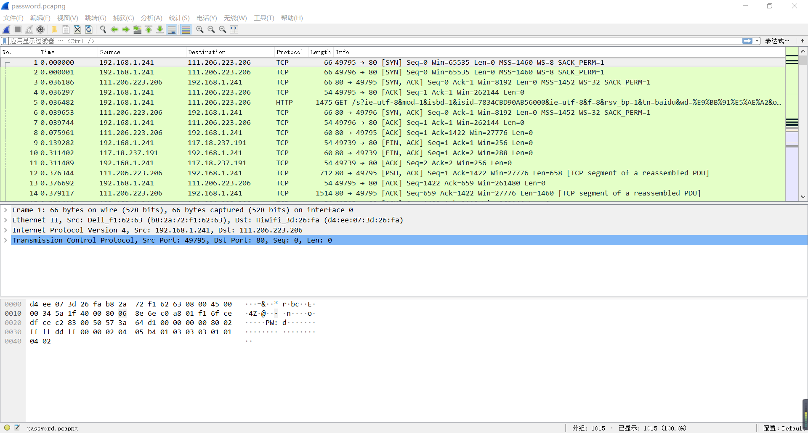

# 编写软件使用 ARP 协议获取局域网内活动主机物理地址

## 一、设计内容 
以太网协议规定同一局域网内的不同主机之间可以根据 MAC 地址直接进行 通信。而根据 TCP/IP 协议，网络层与传输层在传输数据的过程中只关心目的主 机的 IP 地址。在以太网中，上层协议传递给数据链路层的数据包也只包含目的 主机的 IP 地址。因此，需要一种协议根据目的主机的 IP 地址获得其 MAC 地址， 并维护两者之间的对应关系。完成上述任务的协议就是地址解析协议（Address Resolution Protocol，ARP）。

通过该课程设计，期望达到如下目的： 
1. 在了解计算机网络理论知识的基础上，掌握网络编程的知识和技能； 	
2. 理解 ARP 协议的基本原理，掌握 ARP 数据帧的构造方法，学会采用 ARP 协议获得局域网主机 MAC 地址的方法。 
3. 此外，还需要学习使用 WinPcap（或者 Npcap 或者 Win10Pcap）编写 网络程序的基本方法； 
4. 熟悉网络软件的开发过程，锻炼解决实际问题的能力。
 
## 二、要求： 
根据 ARP 协议的基本原理编写程序，获得本地主机所在局域网内部全部活 动主机 IP 地址与 MAC 地址的对应关系。 具体内容和要求如下：
查找资料，分析比较现有的主流的 ARP 程序的功能和优缺点，了解用户 需求，形成详细的软件功能需求分析，并作为最终的课程设计报告的一部分

在此基础上，设计并实现基于 Windows 图形用户界面的 ARP 程序。要求 自行构造 ARP 请求数据帧，使用 WinPcap（根据你所选择的开发平台的差异， 可以选择：Npcap 或者 Win10Pcap）开发包提供的相关函数实现数据帧的发送与 接收。通过解析目的主机的响应数据帧获得局域网内部全部活动主机 IP 地址与 MAC 地址的对应关系。

这部分的设计结果作为报告的“系统结构与设计”部分； 

实验结果分析：需要针对实验测试结果给予解释、分析与说明；
课程设计总结：课程设计取得的成果、存在的不足；课程设计体会与感 想； 

课程设计报告的完整组成：封面、课程设计内容、要求、软件功能需求 分析、系统结构与设计、实验测试结果及结果分析，课程设计总结，参考文献， 源程序清单。

## 三、软件功能需求分析
如今有很多很强大的流量分析软件，如wireshark，ettercap等等，他们各有各的优点。就wireshark来说，它能够很清晰地进行流量分析，展示流量数据包的目的和功能，获取其中的信息，当然，它还能截获arp数据包，掌握局域网的配置

而ettercap就可以对arp进行缓存中毒攻击，不仅仅可以导致对方的电脑无法上网，还可以截获受害者的发送的关键数据包，获取用户的重要信息。
对于本次课程设计，我主要就通过arp协议，发送广播包，获取局域网内的所有主机mac地址。

## 四、系统结构与设计

* 上图（图 1）为系统底层运行的流程图，详细功能如下：
扫描适配器（函数为 SearchAdapter()）
pcap_findalldevs_ex((char*)PCAP_SRC_IF_STRING, NULL, &alldevs, errbuf) ，这段代码为获取所有适配器的核心代码，获取之后可以通过选择适配器列表中的适配器来进行后面的操作。
* 广播
通过创建收包进程，不断接受发送的广播包的同时不断接受（过滤）自己需要的包，提取出其中的ip地址和mac地址，组成字符串输出到对应的对话框中。
软件的图形化如下（图 2）

图中包括了3个对话框（ListBox），两个按钮（Button），以及一个选择列表框，他们的功能有，
三个对话框：展示适配器列表、IP/MAC列表以及消息提示。
两个按钮：功能分别为扫描适配器以及扫描网络中的IP/MAC（通过发送ARP包）。	一个选择列表框，是用来选择适配器用的，只有选择了适配器，扫描网络这个按钮才能发挥出相应的功能。
* 系统运作流程如下：
1. 通过点击ScanAdapter按钮启动函数OnBnClickedScanAdapter()
2. 即启动杉树SearchAdapter()获取适配器链表
3. 再通过选择CComboBox控件中的ADAPTER_CHOOSE列表项选择适配器。遍历适配器链表后获得适配器指针。
4. 再通过点击ScanNetwork按钮启动OnBnClickedScanNetwork();
5. 即启动ipget()函数，同时启动GetLivePC()线程接受相应的arp包
6. 点击QUIT键启动OnBnClickedQuit();函数，实验停止。
* 关键数据结构如下：（arp头）
```C++
struct Arpheader 
{ 
	////帧头部结构体，共14字节 
	u_char DestMAC[6]; //目的MAC地址 6字节
	u_char SourMAC[6]; //源MAC地址 6字节
	u_short EthType; //上一层协议类型，如0x0800代表上一层是IP协议，0x0806为arp  2字节 
	////28字节ARP帧结构 
	unsigned short HardwareType; //硬件类型 
	unsigned short ProtocolType; //协议类型 
	unsigned char HardwareAddLen; //硬件地址长度 
	unsigned char ProtocolAddLen; //协议地址长度 
	unsigned short OperationField; //操作字段 
	unsigned char SourceMacAdd[6]; //源mac地址 
	unsigned long SourceIpAdd; //源ip地址 
	unsigned char DestMacAdd[6]; //目的mac地址 
	unsigned long DestIpAdd; //目的ip地址 
}; 
```

## 五、实验测试结果及结果分析
本次课程设计做了获取适配器列表，发送广播arp包，接受包并分析出MAC地址，用wireshark软件协助证明实验过程。

获取适配器列表并且选择，然后点击扫描网络按钮（如图 3）


可以看到网卡相应的名字，描述以及IP、MAC地址都已经扫描出来。
实际中我打开了IP地址为192.168.52.129的虚拟机，现在以IP地址为192.168.52.129的主机为例（图 4）。


结果分析：可以对照出，两图（图 3图 4）的IP地址均为192.168.52.129，而且它们的MAC地址均为00:0c:29:dc:65:d8。至此，实验成功！

通过wireshark观察发送包的过程如图 5


放大看其中的关键数据。如图6


### 结果分析：
发包实验成功，就图5的例子而言，程序成功地广播了查找IP地址为192.168.52.254的MAC地址，并且得到了回应。至此，实验成功！

### 缺点分析：
1. 实验中有几率出现这种情况（图7）：

意思为返回包，然而不好读懂，我也想不到办法解决它。
2. 有几率出现线程无法消除的情况。
3. 自身的MAC地址获取函数我没有实现，因为改了好几次都失败了，我把这个函数拆散纳入到收包线程中，但是并没有发挥出应有的功能

## 六、参考文献
1．http://www.codes51.com/itwd/3726455.html
2．https://blog.csdn.net/swartz_lubel/article/details/75670474
3．https://blog.csdn.net/CHS007chs/article/details/41777849
4．https://www.cnblogs.com/yingfang18/archive/2010/11/28/1890164.html
5．https://blog.csdn.net/u014133104/article/details/80054577
6．https://blog.csdn.net/riscben/article/details/49125035
