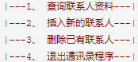

# 《Python语言程序设计实验》课程要求
### 1、	独立完成给定的十四个题目，并撰写报告，报告要求见附件
### 2、	报告电子版上传云班课（学号姓名.docx），打印版请正反面打印并装订，班长统一收齐上交。电子版和打印版齐全者才评定成绩。
### 3、	不得抄袭，抄袭者不通过
### 4、	题目如下
题目1：用 Python 编程，假设一年期定期利率为 3.25%，计算一下需要过多少年，一万元的一年定期存款连本带息能翻番？

题目2：企业发放的奖金根据利润提成。利润(I)低于或等于10万元时，奖金可提10%；利润高于10万元，低于20万元时，低于10万元的部分按10%提成，高于10万元的部分，可可提成7.5%；20万到40万之间时，高于20万元的部分，可提成5%；40万到60万之间时高于40万元的部分，可提成3%；60万到100万之间时，高于60万元的部分，可提成1.5%，高于100万元时，超过100万元的部分按1%提成，从键盘输入当月利润I，求应发放奖金总数。

题目3：一个整数，它加上100后是一个完全平方数，再加上168又是一个完全平方数，请问该数是多少？

题目4：从键盘输入一行字符，统计出每种字符的个数。

题目5：猜数游戏。预设一个 0~9 之间的整数， 让用户猜一猜并输入所猜的数， 如果大于预设的数， 显示“太大”； 小于预设的数， 显示“太小”， 如此循环， 直至猜中该数， 显示“恭喜！ 你猜中了！”。

题目6：从键盘输入一个5位数，判断它是不是回文数。即12321是回文数，个位与万位相同，十位与千位相同。

题目7：用递归算法解决汉诺塔问题

题目8：有一个文件名为 class_score.txt 的文本文件， 存放着某班学生的学号、 数学课成绩（第 2 列） 和语文课成绩（第 3 列）。 请编程完成下列要求：
（1）分别求这个班数学和语文的平均分（保留 1 位小数） 并输出。
（2）找出两门课都不及格（<60） 的学生， 输出他们的学号和各科成绩。
（3） 找出两门课的平均分在 90 分以上的学生， 输出他们的学号和各科成绩。
建议用三个函数分别实现以上要求。

题目9：（1） 创建一个名为GeometricObject的类和它的两个名为Circle和Rectangle的子类；GeometricObject有颜色属性。Circle有半径属性，Rectangle有长和宽属性，两者都有求周长和面积的方法； 
（2） 在testGeometric类中编写测试程序，创建颜色为红色、半径为5的圆和颜色为蓝色、长为10、宽为5的矩形，分别显示它们的颜色、周长和面积。

题目10：使用GUI编程实现一个计算器，可以进行基本的加减乘除功能

题目11：实现一个通讯录，保存姓名、单位、电话号码内容在文件中。功能包括：显示所有联系人、插入新的联系人、删除已有联系人、退出。这些功能应该是可以重复进行。菜单形式可以如下所示：

题目12：实现一个文本编辑器，可以打开文件、修改内容、保存文件、关闭，使用菜单实现相应功能要求。

题目13：使用数据库，开发一个管理图书信息的程序。图书的属性有ISBN、书名、版次、作者、出版社、价格。要求可以增加、删除、查询图书。

题目14：网络-基于socket开发一个聊天程序，实现两端互相发送和接收消息，退出时保存聊天记录到文件中。 
